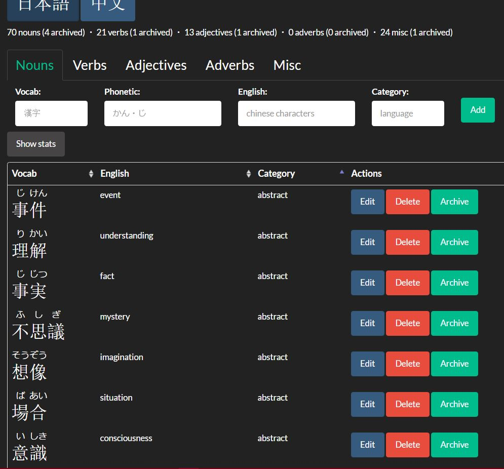

# usami

A Django-based vocabulary learning/tracking app for potentially any language -- as in "people" language, not programming :) -- especially geared toward logographic scripts

Very early days, but current functionality includes
* Rough framework (models, view functions, etc.) for implementing any language
* Add/remove vocab to/from sortable tables for different parts-of-speech
* Dynamic rendering of [ruby text](https://www.w3.org/TR/html-ruby-extensions/) for phonetic guides (e.g. for hanyupinyin or furigana)

Definitely want to make the whole thing much more dynamic and JS-heavy, like editing rows in-place and stuff...

The idea is to introduce loads more useful features that would make it more than a glorified spreadsheet, for now just off the top of my head:
* Adjustable "familiarity" ratings
* Spaced repetition / flashcards / (etc.) based on the above
* Statistics / visualization / other cool stuff like that

---

Snapshot

---

##### My thoughts/ramblings, feel free to stop reading here

##### 2017-03-06
* The "category" column should be the one to pivot on - to divide huge masses of vocab into bite-sized chunks...

###### 2017-02-26
* Experimenting with using [this resource](https://github.com/Doublevil/JmdictFurigana) to derive furigana from a local database - the general idea seems to work, but it doesn't seem to be entirely comprehensive... might be best after all to just supply the furigana manually. That way also eliminates ambiguity with multiple readings (of course we can't determine it a priori and without context). It's still a really cool resource though and it'd be nice to still make use of it in some way...

###### 2017-02-25
* First commit with the most basic of functionality